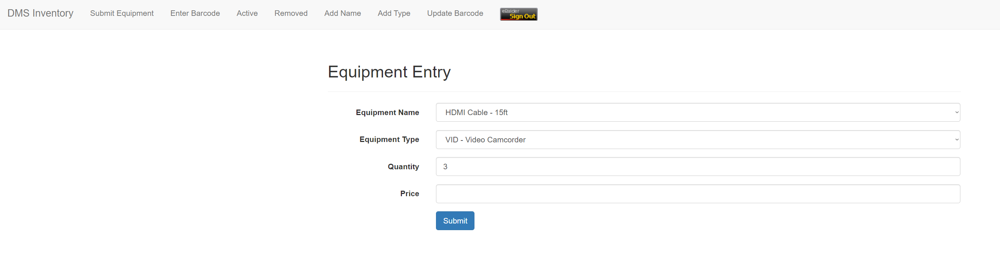

# Work Code Snippets

This repo hosts some work code (with senstive info removed) and screenshots of my UI work since authentication I have implemented for the web applications won't allow the public to access them. Let me know if you want me to explain what the code does - I would be happy to do so.
 

### Screenshot of ticketing application I'm working on now
Instead of Bootstrap 4, I decided to use Semantic UI just to do something different.

### Revamped ILLiad Document Delivery pages
One of first tasks I did when I first started in 2015. Used Bootstrap 3 and jQuery UI. I also coded the "Schedule A Pickup" feature which sends an email to Document Delivery staff when faculty member wants to get books or other documents.

### TTU Library Study Carrel Reservation submission form
The application uses getskeleton.com as the UI framework. All the input fields (except Comments) are autofilled with the respective info from TTU's eRaider authentication system. I just remove the sensitive info.

### TTU Library Study Carrel Application - Pending Page
Here you can see my pending reservation. The Reject button removes the reservation from the SQL Server database. Accept button moves it to another table with active reservations. Let's see what happens when Contract is clicked...

### TTU Library Study Carrel Application - Contract Modal
The Contract button brings up a contract modal, which comes from jquerymodal.com. Student has to physically come to the library to initial the contract and a staff member enters the carrel room #. Student gets an email with contract attachment when Send is clicked and contract can be seen with View button. Let's take a look at the contract that is generated with PHP.

### TTU Library Study Carrel Application - My Contract
I use tcpdf.org to generate the contract PDF taking the input values from the contract modal. Code for that can be seen [here](contract.php).

### LBSI Inventory Application - Add Inventory From Excel File
Something that was unique to this project was adding inventory from an Excel. Useful for adding about 1500 items to the system. Code for this part can be seen [here](processExcelFile.php).

### DMS Inventory Application - DataTables implmentation and custom features
Yes, ANOTHER inventory tracking system! Here you can see DataTables being used in conjunction with Bootstrap styling. Project client requested custom features such as the equipment history and the + buttons that use a AJAX POST method to submit an UPDATE query to a PHP file. Also, the AV# is generated with PHP when the inventory item is first submitted and is unique for all inventory. I'll show this inventory submission form in the next screenshot.

### DMS Inventory Application - Submission Form
Pretty simple form here. The Equipment Name and Type dropdown options aren't hard coded. They are managed in the 'Add Name' and 'Add Type' links you see in the top navbar. Quantity controls how many items are to be submitted. Code for the form can be seen [here](dmsSubmissionForm.php). Once Submit is clicked, form is processed. The procecssing code is [here](processEntry.php)

### SHAPES project
SHAPES is a 3D-printing project that I collaborated with another programmer. The project allow users to submit metadata and specific images for purpose of printing a 3D object from images. I worked the accounts/authentication/submission part of the project. First image is the registration form.

This image is the user submission form. Hardest part of programming this was getting the images uploaded to the SHAPES server to be displayed later on the admin side.

And here's the admin side of the project. Admins review user submissions and either accept or reject them.

